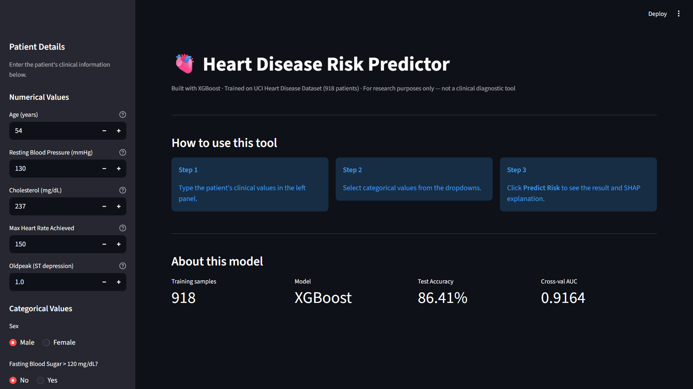
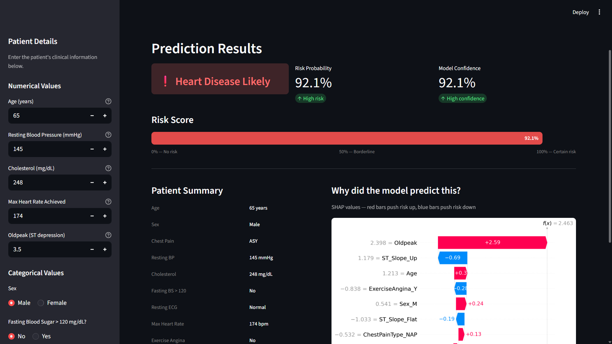
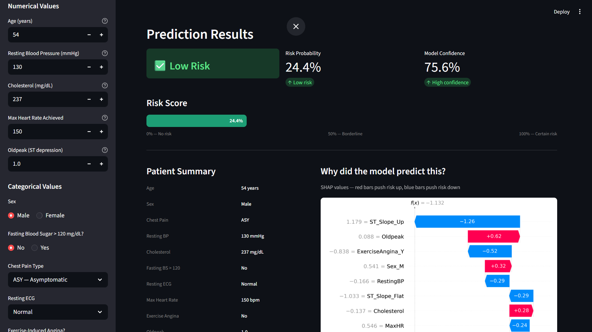

# 🫀 Heart Disease Risk Predictor

A machine learning web application that predicts the risk of heart disease from clinical patient data, built with XGBoost and deployed via Streamlit.

> Built by **Dhrisit** · 2nd Year B.Tech CSE · As part of an internship application portfolio

---

## 🔴 Live Demo

[](https://https://cardiac-risk.streamlit.app/)

---

## 📌 What This Project Does

This app takes 11 clinical measurements from a patient — such as age, cholesterol, resting blood pressure, chest pain type, and ECG results — and predicts whether the patient is at risk of heart disease.

It goes beyond a basic prediction model by also explaining **why** the model made its decision using SHAP (SHapley Additive exPlanations) — showing which features pushed the risk up or down for each individual patient.

---

## 🧠 Model Details

| Property | Detail |
|---|---|
| Dataset | [Heart Failure Prediction Dataset](https://www.kaggle.com/datasets/fedesoriano/heart-failure-prediction) — Kaggle |
| Dataset size | 918 patients, 12 features |
| Best model | XGBoost (with GridSearchCV hyperparameter tuning) |
| Best XGBoost params | learning_rate: 0.1, max_depth: 5, n_estimators: 50 |
| Cross-validation AUC | 0.9164 ± 0.0090 (5-fold StratifiedKFold) |
| Other models compared | Logistic Regression, Random Forest, Decision Tree, SVM |
| Explainability | SHAP TreeExplainer — global + per-patient waterfall plots |

---

## 📊 Features

- **5 models trained and compared** — Logistic Regression, Random Forest, XGBoost, Decision Tree, SVM
- **ROC curve comparison** — all 5 models on a single plot
- **5-fold cross validation** — reliable AUC scores with mean ± std
- **Learning curve** — shows model generalisation vs training size
- **Calibration curve** — checks whether predicted probabilities are trustworthy
- **SHAP explainability** — global feature importance + per-patient waterfall plots
- **Interactive Streamlit dashboard** — sliders and dropdowns for patient input, live risk score and SHAP chart

---
## 📸 Screenshots

### Landing Page


### Prediction Result — Heart Disease Likely


### Prediction Result — Low Risk


---
## 📈 Results Summary

| Model | Test Accuracy | Test F1 (Disease) | Cross-Val AUC |
|---|---|---|---|
| Logistic Regression | 86.41% | 0.88 | 0.9194 ± 0.0110 |
| **XGBoost (best)** | **86.41%** | **0.88** | **0.9164 ± 0.0090** |
| Random Forest | 84.78% | 0.87 | 0.9175 ± 0.0185 |
| SVM | 84.78% | 0.87 | 0.9099 ± 0.0175 |
| Decision Tree | 80.98% | 0.83 | 0.7804 ± 0.0257 |

XGBoost was selected as the final model due to its **lowest cross-validation std (±0.0090)** — meaning its performance is the most stable and consistent across different data splits. While Logistic Regression achieves a marginally higher mean AUC (0.9194 vs 0.9164), XGBoost's lower variance makes it more reliable for deployment on unseen data.

### Model Performance Highlights
- XGBoost achieves **86.41% accuracy** and **AUC 0.9164 ± 0.0090** — most stable across all folds
- All top models (Logistic Regression, Random Forest, XGBoost, SVM) exceed **84% accuracy** and **0.91 AUC**
- Decision Tree included as a baseline to demonstrate the value of ensemble methods

---

## 🔍 Key Technical Decisions

**Why XGBoost?**
XGBoost achieved the lowest cross-validation standard deviation (±0.0090) across all 5 folds, making it the most consistent and reliable model for deployment. Its built-in support for SHAP TreeExplainer also makes it the most interpretable choice for a medical application.

**Why SHAP?**
In a medical context, knowing *why* a model made a prediction is as important as the prediction itself. SHAP provides both global feature importance (which features matter most across all patients) and local explanations (which features drove this specific patient's risk score up or down).

**Why conditional SMOTE?**
The dataset has a class ratio of 1.24 (508 positive vs 410 negative). Since this is below the 1.5 threshold for meaningful imbalance, SMOTE was not applied — avoiding artificially inflated accuracy scores from training on synthetic data.

**Cholesterol zero fix**
172 patients in the dataset have Cholesterol = 0, which is physiologically impossible and represents a data entry error. These were replaced with the median cholesterol of non-zero entries (237 mg/dL) before training. The same fix is applied in the Streamlit app when a user enters 0.

**One-hot encoding baseline correction**
`pd.get_dummies(drop_first=True)` removes one category per feature as a baseline. The interactive prediction interface correctly maps baseline categories (ASY, TA, LVH, Down) to all-zeros rather than referencing non-existent columns — a subtle but critical bug fixed in this implementation.

---

## 🗂️ Project Structure

```
heart-disease-predictor/
│
├── app.py                      # Streamlit web application
├── best_xgb_model.joblib       # Trained XGBoost model (saved weights)
├── scaler.joblib               # Fitted StandardScaler
├── requirements.txt            # Python dependencies
└── README.md                   # This file
```

The full training notebook is available on request.

---

## 🚀 Getting Started

### Prerequisites
- Python 3.8 or higher
- pip

### Installation

```bash
# 1. Clone the repository
git clone https://github.com/dhrisit07-cloud/heart-disease-predictor.git
cd heart-disease-predictor

# 2. Install dependencies
pip install -r requirements.txt

# 3. Run the app
streamlit run app.py
```

The app will open automatically at `http://localhost:8501`

---

## 🖥️ How to Use

1. Enter the patient's clinical details in the left sidebar
2. Adjust sliders for numerical values (Age, Blood Pressure, Cholesterol, etc.)
3. Select categorical values from dropdowns (Chest Pain Type, ECG, ST Slope)
4. Click **Predict Risk**
5. View the prediction, risk probability score, confidence level, and SHAP explanation

---

## 📋 Input Features

| Feature | Type | Description |
|---|---|---|
| Age | Numerical | Patient age in years |
| Sex | Categorical | Male / Female |
| Chest Pain Type | Categorical | ATA / NAP / ASY / TA |
| Resting BP | Numerical | Resting blood pressure (mmHg) |
| Cholesterol | Numerical | Serum cholesterol (mg/dL) |
| Fasting Blood Sugar | Categorical | > 120 mg/dL: Yes / No |
| Resting ECG | Categorical | Normal / ST / LVH |
| Max Heart Rate | Numerical | Maximum heart rate achieved |
| Exercise Angina | Categorical | Exercise-induced angina: Yes / No |
| Oldpeak | Numerical | ST depression induced by exercise |
| ST Slope | Categorical | Up / Flat / Down |

---

## ⚠️ Disclaimer

This tool is for **research and educational purposes only**. It is not a substitute for professional medical advice, diagnosis, or treatment. Always consult a qualified healthcare provider for medical decisions.

---

## 👤 About

**Dhrisit**
2nd Year B.Tech — Computer Science and Engineering

Interests: Machine Learning, Deep Learning, Computer Vision, NLP, Healthcare AI

GitHub: [dhrisit07-cloud](https://github.com/dhrisit07-cloud)
